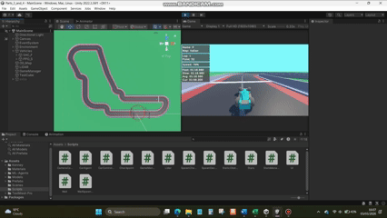

# Deep Reinforcement Learning in Competitive Racing Simulations
This project explores Deep Reinforcement Learning (DRL) in autonomous racing simulation environments. Developed as part of my third-year university project, it investigates how DRL agents can learn optimal racing strategies, avoiding collisions with both track boundaries and other vehicles. Agents were tested on various tracks, with various algorithms, such as PPO and SAC.

## Demo GIF

## Technologies Used:
1. Unity Game Engine
2. C#
3. Unity ML-Agents package
